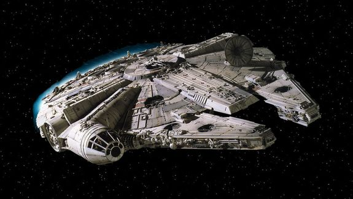

# Objetivos Del Proyecto

El objetivo de este proyecto consiste en la elaboración de un simulador de naves espaciales.

Este proyecto se compone de dos Clases:

- La primera clase, [SpaceShip](docs/SpaceShip.md)

- La segunda clase, [Cargo](docs/Cargo.md)

**SpaceShip**

Se trata de la clase principal, la cual contendrá los atributos de las Naves Espaciales.

SpaceShip incluirá los siguientes métodos:

1. speedUp
2. toString
3. brake
4. emergencyStop

**Cargo**

Esta clase extiende de la anterior, incluyendo un nuevo atributo y diferentes funcionalidades.

Cargo incluirá los siguientes métodos:

1. load
2. unload

